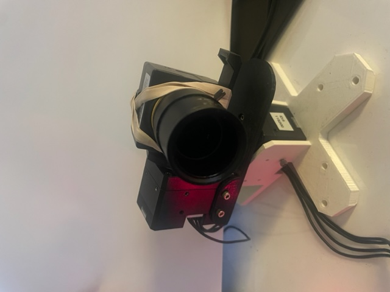

# examples.camera_follow

This example demonstrates usage of several roboflex modules, including dynamixel, webcam_uvc, transport/mqtt, and metrics_central. In particular, it demonstrates how easy it is to perform computer vision tasks using python in roboflex.

This example creates a face-following camera using a webcam and two dynamixel motors. It uses the 'yoloface' repo (cloned from https://github.com/elyha7/yoloface into this repo) to perform face detection. It requires two dynamixel motors arranged in a pan-tilt configuration, and a uvc-compatible webcam. Rubber-banding optional.

To run:

1. in this repo: `git clone https://github.com/elyha7/yoloface`
2. Create a python virtual environment in your favorite way, using the requirements in requirements.txt.
3. python camera_follow.py

